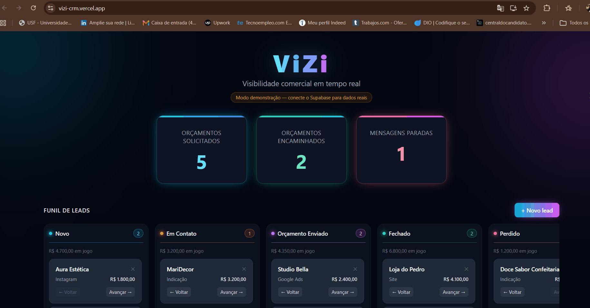

# Vizi CRM

🔗 **Demo ao vivo:** [vizi-crm.vercel.app](https://vizi-crm.vercel.app)

## Antes e depois

O visual do Vizi passou por um redesign completo — de um tema neon escuro pra um
visual claro e corporativo, com landing page própria e mais funcionalidades no funil.

**Antes** — tema neon escuro, funil simples


**Depois** — visual claro corporativo, landing page, cadastro completo e mais campos no lead


Vizi CRM é uma aplicação desenvolvida para atuar como uma camada analítica e organizacional, auxiliando empresas na tomada de decisões estratégicas e operacionais.

A plataforma funciona como uma "peneira inteligente", analisando os dados do processo comercial para identificar padrões, gargalos e oportunidades de melhoria. O objetivo é ajudar empresas a entenderem quais ações estão gerando resultados e quais processos precisam ser ajustados.

## Problema que resolve

Empresas que recebem alto volume de leads frequentemente perdem visibilidade sobre seu processo comercial — não sabem quantos orçamentos foram solicitados, quais campanhas funcionaram ou onde os leads estão parando. O Vizi torna essas informações visíveis em tempo real.

## Tecnologias utilizadas

* React.js
* JavaScript
* Tailwind CSS
* HTML5
* CSS3
* Supabase (banco de dados, autenticação e realtime)
* Vercel Functions + API da Anthropic (Claude), para o assistente de métricas

## Como executar o projeto

```
npm install
npm start
```

O projeto será iniciado em http://localhost:3000

Por padrão, o app roda em **modo demonstração** (dados locais de exemplo). Para
conectar a um banco real, copie `.env.example` para `.env.local` (esse nome é
importante — é o único ignorado pelo Git, então suas chaves não vão parar no
GitHub), preencha com as chaves do seu projeto Supabase e rode o script
`supabase_setup.sql` no SQL Editor do Supabase.

Não existe cadastro público de contas reais: quem acessa o funil de verdade
precisa de uma conta criada manualmente no Supabase Dashboard
(Authentication > Users > Add user). Isso é proposital — evita que qualquer
visitante do site crie conta e veja os dados reais de outra pessoa.

## Funcionalidades atuais

* Landing page de apresentação, com proposta de valor, "Como funciona" e funcionalidades
* Três formas de entrar: ver o funil direto em modo demonstração (sem cadastro), criar conta (formulário completo — hoje só visual, cai em modo demo) ou entrar com login real (Supabase Auth, para contas criadas manualmente)
* Dashboard com 3 métricas principais em tempo real (orçamentos solicitados, orçamentos encaminhados, mensagens paradas)
* Funil de leads em formato Kanban, com etapas do processo comercial (Novo, Em contato, Orçamento Enviado, Fechado, Perdido)
* Cadastro, edição (nome, origem, valor, telefone, tags, notas), movimentação entre etapas e remoção (com confirmação) de leads
* Integração com Supabase, incluindo atualização em tempo real (realtime) e autenticação
* Acesso aos dados reais protegido por login — RLS no banco só libera leitura/escrita pra quem está autenticado
* Aviso visível quando uma operação no Supabase falha (falha de rede, permissão, etc.)
* Modo de demonstração com dados de exemplo, para quem só quer olhar sem logar
* **Assistente de métricas**: pergunte sobre o funil em português simples e receba uma resposta gerada por IA (Claude), com base só em números agregados — nunca nome, telefone ou notas de lead nenhum
* Interface responsiva, clara e corporativa
* CI no GitHub Actions rodando testes e build a cada push
* Hospedado na Vercel

## Próximas etapas

**Produto**
* Cadastro público (hoje "Experimente grátis" só mostra o modo demo — criar conta de verdade continua manual, pelo Supabase Dashboard)
* Conexão com WhatsApp pra puxar atendimentos pendentes automaticamente (hoje o atendimento é registrado manualmente no funil)
* Painel de resultados/benefícios pra quem estiver testando o Vizi

**Técnico / qualidade**
* Isolar dados por usuário (hoje quem está autenticado vê a mesma tabela — funciona bem para um único negócio piloto, mas não escala pra múltiplos clientes sem uma coluna de dono + política por `auth.uid()`)

## Autora

Natilla — [GitHub](https://github.com/nhatilla-integration)
